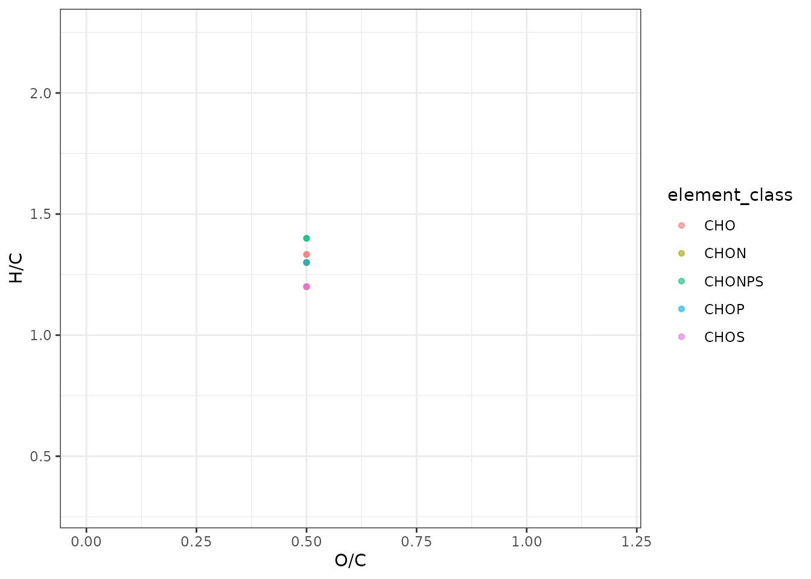
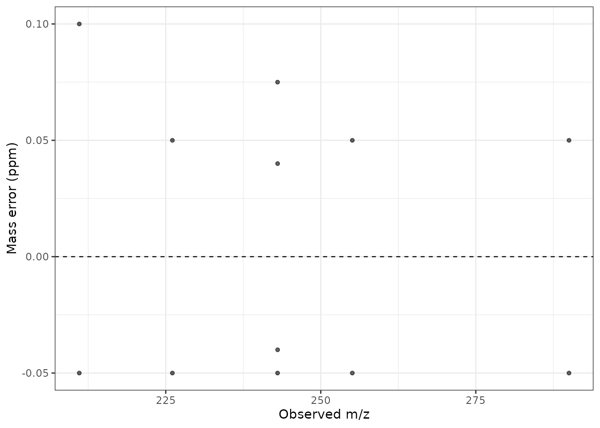
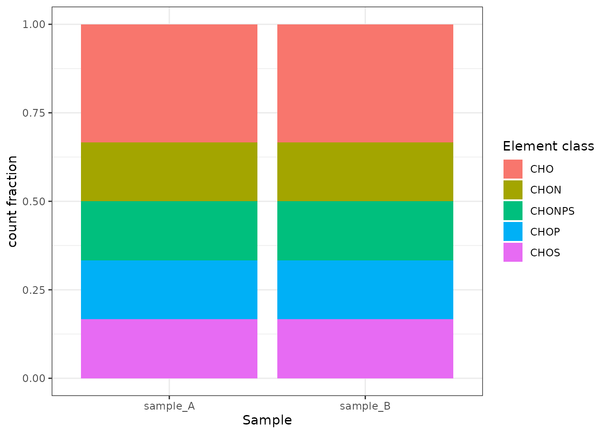
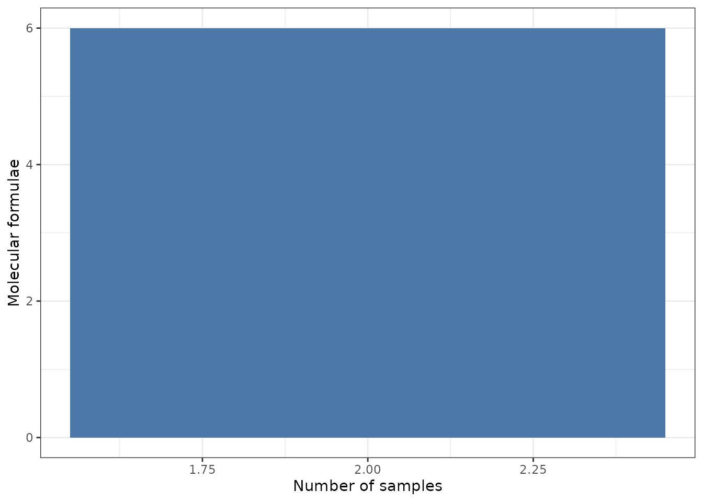

# Visualization

All plot functions return editable ggplot objects and attach the plotted
data as `attr(plot, "plot_data")`. Set `return_data = TRUE` to receive
both explicitly.

``` r

library(DOMformulaR)
path <- system.file("extdata", "simulated_peaks.csv", package = "DOMformulaR")
cfg <- read_dom_config(system.file("extdata", "example_config.yml", package = "DOMformulaR"))
result <- run_dom_workflow(path, cfg)
plot_van_krevelen(result$assigned_formulas)
```



``` r

plot_mass_error(result$assigned_formulas)
```



``` r

plot_element_classes(result$assigned_formulas)
```



``` r

plot_shared_formulas(result$assigned_formulas)
```


